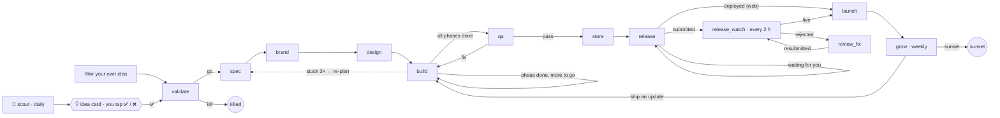
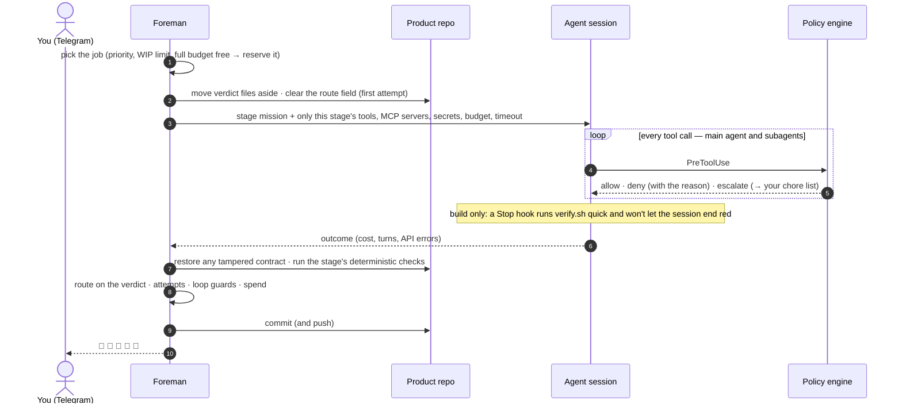

<div align="center">

# Sedef 🦪

**An autonomous product factory on Claude.**

You approve ideas on your phone. Agents validate them, give them a brand, design, build, test, ship them to the stores and grow them — day and night — and ask you only for the few things no API can do.

[What it is](#what-it-is) · [How it works](#how-it-works) · [Your touchpoints](#your-touchpoints) · [Safety](#safety-model) · [Install](#install) · [Operate](#operate) · [Extend](#extending-sedef)

</div>

> *Sedef* is Turkish for nacre, mother-of-pearl: a pearl grows layer by layer around a grain of sand. Every stage here is one layer.

> [!IMPORTANT]
> **Status: v0.1, not yet run on a real Mac.** The runner, policy engine, scheduler, budgets and the Claude Agent SDK wiring are tested end to end (52 tests, including a full foreman run with a scripted session, plus live SDK sessions against a stub API). The macOS-only parts — Xcode builds, simulators, store uploads — run for the first time on your Mac. Watch the first product through `spec` and `brand` before letting several run in parallel.

---

## Contents
- [What it is](#what-it-is)
- [Why it's built this way](#why-its-built-this-way)
- [How it works](#how-it-works)
  - [The pipeline](#the-pipeline) · [A day in the factory](#a-day-in-the-factory) · [One stage run, step by step](#one-stage-run-step-by-step) · [Stage reference](#stage-reference) · [Product states](#product-states)
- [Your touchpoints](#your-touchpoints)
- [Making every product look different](#making-every-product-look-different)
- [Skills, subagents and MCP servers](#skills-subagents-and-mcp-servers)
- [Revenue lanes and payment rails](#revenue-lanes-and-payment-rails)
- [Safety model](#safety-model)
- [Install](#install)
- [Configure](#configure)
- [Operate](#operate)
- [Costs](#costs)
- [Repository layout](#repository-layout)
- [Extending Sedef](#extending-sedef)
- [Development](#development)
- [Honest limits](#honest-limits)
- [Research and credits](#research-and-credits)

---

## What it is

Sedef is a small TypeScript daemon (the **foreman**) that runs on a Mac and drives [Claude Agent SDK](https://code.claude.com/docs/en/agent-sdk/typescript.md) sessions through a fixed pipeline of stages. Each stage is **one fresh agent session** with its own mission, tools, MCP servers, budget and deterministic exit checks. All state lives in files and git, so the factory can stop, crash or sleep at any moment and pick up exactly where it was.

| | |
|---|---|
| **You** | tap ✅/❌ on idea cards in Telegram, close a short weekly list of human-only chores (~15 min), and can stop everything with `/dur` |
| **The foreman** | schedules sessions, answers every permission prompt through a policy engine, reserves budgets, runs the checks, routes products between stages, commits, and talks to you |
| **The agents** | one per stage: a strategist scouts and validates, leads spec/design/build/QA/ship, specialist subagents do focused work, an independent evaluator is the only one allowed to mark progress |
| **The products** | one git repo each, in the phase-runner convention (`STATUS.md`, `docs/phases/`, `docs/DECISIONS.md`) — any human can take over mid-product |

What makes it different from "an agent in a loop":

- **You are only at the idea gate.** Permission prompts are answered by a deterministic, unit-tested policy (`config/policy.yaml`), not by you. Steps no store API allows arrive as batched, copy-paste chores.
- **Verifiers the agents cannot edit.** Acceptance contracts (Maestro flows / Playwright specs) are written in `spec` and frozen during `build`; tampering is detected and reverted. A stop hook refuses to let a build session end while the build is red.
- **Anti-sameness by construction.** A seeded constraint deck, Verbalized Sampling, Google's DESIGN.md format and a **novelty ledger** that rejects a brand too close to anything the factory shipped before.
- **Different tools per stage.** 15 factory skills, 14 subagents, 19 MCP servers in the catalog, the `asc` App Store Connect CLI, optional cross-vendor design critic.
- **Money-safe by default.** A session starts only when its full budget is free; daily/monthly/per-product caps; loop guards; outages and revoked keys never burn a product's attempts.
- **Beyond iOS.** iOS, iOS+Android (Expo), web SaaS, Chrome extensions, Mac direct sales, Apify actors, Figma plugins, digital assets — with payment rails that work for a Turkey-based seller.

---

## Why it's built this way

The design follows what the setups that actually ship have in common (sources in [docs/RESEARCH.md](docs/RESEARCH.md)):

| Finding | What Sedef does about it |
|---|---|
| Long sessions rot; fresh context + state in files works ("Ralph loop", `/goal`) | one session per stage, one build phase per session, everything in the repo |
| Agents grade their own work too kindly | a separate `evaluator` subagent is the only writer of the scoreboard; the foreman demands measurable progress |
| The verifier must be nearly perfect and untouchable | contracts written in `spec`, immutable in `build` (tool policy + shell rules + snapshot/restore), stop gate |
| Runaway cost and non-convergence | session/day/month/product budgets, attempts, re-plan limits, loop guards, park |
| Approval prompts don't add safety; containment does | a policy engine instead of prompts, a dedicated macOS user, secrets outside the agents' reach, capability separation |
| Prompt injection comes through web pages and third-party skills | only two stages read the open web — and they have no shell and no secrets; agents can't change skills, settings or `.mcp.json` |
| Building is easy; customers are the bottleneck | validation requires a first-100-users plan; launch, weekly growth and portfolio stages; products are killed freely |
| Apple 4.3(b) (June 2026) punishes repeated low-effort submissions | a rolling cap on new-app submissions, a compliance audit before every submission, novelty checks, a separate organization account |
| Models converge on the same taste ("artificial hivemind") | seeded direction draws, tail sampling, distance-based novelty check, optional critic from another model family |

---

## How it works

### The pipeline



Two factory-level jobs run every Sunday: **portfolio** (double down / iterate / keep / sunset / unpark / kill, with a Turkish summary for you) and **retro** (learnings from failures, rejections and denials, plus skill-improvement proposals you can apply with one command).

Products closer to launch get session slots first. By default two sessions run in parallel, and scouting pauses while three products are between validation and store submission (or six idea cards wait for you).

### A day in the factory

| When (Europe/Istanbul) | What happens |
|---|---|
| **08:30** | `scout` harvests demand signals and posts 0–3 idea cards → ✅ / ❌ |
| **all day** | products move stage by stage; you hear about launches 🚀, approvals 🎉, rejections 📮, parked products 🧯 and blocking chores 🔑 |
| **00:30–08:00** | quiet hours: non-urgent messages wait; urgent ones (budget stop, API key refused, your own commands) go through |
| **21:00** | daily digest: what moved, spend vs budget, parked products, chores waiting for you |
| **Sunday 10:00** | portfolio review |
| **Sunday 11:30** | retro: learnings + proposals |

### One stage run, step by step



Rules the foreman applies after every session:

- **Checks are deterministic** (`files_exist`, `command`, `json_field`, `novelty`) and run outside the agent's reach.
- **A session that didn't finish cleanly never passes** (turn/budget limit, API error). Exceptions: `build`, which is judged by measurable progress, and an irreversible outcome such as a store submission, which a re-run would only repeat.
- **A route value that leads nowhere is a failed attempt**, never "done".
- **Failed attempts write `.sedef/feedback/<stage>.md`**; the next session reads it first. After `max_attempts` the stage's `on_exhausted` rule applies: park, kill, or re-plan (`build` → `spec`, at most twice).

### Stage reference

| Stage | Model tier | Web | MCP servers | Must leave behind (checked by the runner) | Next | Budget / session |
|---|---|---|---|---|---|---|
| **scout** · daily, factory | strategist | open, **no shell** | sedef_data, apify | 0–3 idea cards | your ✅ / ❌ | $8 |
| **validate** | strategist | open, **no shell** | sedef_data, apify | `.sedef/brief.md`, `verdict.json` (go/kill, lane) | go → spec · kill → killed | $8 |
| **spec** | lead | docs | context7 | PRD, `feature_list.json`, `progress.json`, phase files, STATUS/DECISIONS, contracts (`verify.sh contract`) | brand (build on a re-plan) | $12 |
| **brand** | strategist | docs | sedef_data, fal, recraft, replicate, stitch, figma | `DESIGN.md` (lints), `fingerprint.json` (passes novelty), naming, direction, 1024 px icon | design | $14 |
| **design** | lead | docs | figma, stitch, mobbin, refero, playwright, mobilebuild | UI spec, motion spec, rendered screens, critique `pass` | build | $14 |
| **build** ⟲ | lead | docs | mobilebuild, maestro, context7, playwright, revenuecat, supabase | `verify.sh quick` green **and** `phases_done` up by one | build · qa · re-plan → spec | $22 |
| **qa** | lead | docs | mobilebuild, maestro, playwright, context7 | `qa-report.md`, `qa.json` (pass/fix) after `verify.sh full` | store · build | $12 |
| **store** | lead | docs | sedef_data, mobilebuild, playwright, fal, recraft, elevenlabs, revenuecat | listing, screenshots, legal `site/`, compliance `pass`, `verify.sh store` | release | $14 |
| **release** | lead | docs | revenuecat, expo | `release.json` status; no placeholder legal URLs left | release_watch · launch · wait | $10 |
| **release_watch** · every 2 h | fast | none | — | `review-status.json` | launch/grow · review_fix · wait | $0.80 |
| **review_fix** | lead | docs | mobilebuild, maestro, context7 | fix + resubmission in `release.json` | release_watch | $14 |
| **launch** | lead | docs | fal, recraft, elevenlabs, playwright | `launch/launch-plan.md`, `launch.json` | grow (a week later) | $10 |
| **grow** ⟲ weekly | lead | docs | sedef_data, revenuecat, context7 | growth report, `grow.json` (build/wait/sunset) | build · grow · sunset | $8 |
| **portfolio** · Sunday | strategist | docs | sedef_data, revenuecat | `portfolio/decisions.json` + Turkish summary | — | $6 |
| **retro** · Sunday | lead | none | — | learnings, proposals, report | — | $5 |

The full definitions — tools, secrets, immutable files, stop gate, routes, attempts — are in [`config/pipeline.yaml`](config/pipeline.yaml); each stage's mission is in [`prompts/stages/`](prompts/stages).

**Model tiers** (change them in `config/sedef.config.yaml → models`):

| Tier | Default | Used for |
|---|---|---|
| strategist | `claude-fable-5-1` | judgment: scouting, validation verdicts, brand direction, portfolio |
| lead | `claude-opus-5-5` | spec, design, build, QA, store, release, growth |
| worker | `claude-sonnet-5-5` | subagent bulk work (set per agent in `plugin/agents/*.md`) |
| fast | `claude-haiku-4-5-20251001` | cheap polling (`release_watch`) |
| fallback | `claude-opus-5-5` | when the primary model is overloaded or unavailable |

### Product states

| State | Meaning |
|---|---|
| `ready` | eligible for the next free session slot |
| `running` | a session is working on it (after a crash or reboot it becomes `ready` again and the attempt is given back) |
| `waiting` | polling (`release_watch`, `grow`), backing off after an outage, or waiting on itself (1 h → 2 h → 4 h → 8 h) |
| `blocked` | a blocking chore is open — it resumes the moment you close it |
| `failed` | parked: attempts used up, pre-launch budget spent, or a loop detected; the Sunday portfolio review can unpark or kill it |
| `done` | killed or sunset |

---

## Your touchpoints

| When | What | Time |
|---|---|---|
| Daily (optional) | ✅/❌ on 0–3 idea cards · read the 21:00 digest | 1–2 min |
| Weekly | close the batched chores (app records, privacy labels, Play forms …) | ~15 min |
| Rarely | override a kill verdict on your own idea, approve a first submission (if enabled), apply a proposal | one tap |
| Any time | `/dur` stops everything · `/durum` shows everything | — |

### Telegram commands (Turkish UI)

| Command | Does |
|---|---|
| `/durum` | products by stage, spend, pending ideas and chores |
| `/fikir <metin>` | your own idea goes straight into validation |
| `/onayla <id>` · `/gec <id>` | decide an idea card (same as the ✅/❌ buttons) |
| `/isler` · `/tamam <id> [seçenek veya değer]` | list / close chores; a value answers a chore that asked for one (e.g. a Chrome Web Store item ID) |
| `/red <slug> <metin>` | paste an App Review rejection → the product goes to `review_fix` |
| `/calistir <slug> <aşama>` | force a product into a stage |
| `/oldur <slug>` | stop a product |
| `/dur [neden]` · `/devam` | kill switch: stop all sessions now / resume |
| `/butce` | spend today, this month, top products |
| `/oneriler` · `/uygula <n>` | skill proposals from the retro / apply one |

English aliases work too (`/status`, `/idea`, `/approve`, `/reject`, `/chores`, `/done`, `/rejection`, `/run`, `/kill`, `/pause`, `/resume`, `/budget`, `/proposals`, `/apply`).

### The same on the Mac

```text
sedef status | chores | budget | doctor | validate-config
sedef idea "<text>"             sedef approve|reject <id>        sedef done <id> [option]
sedef run <slug> <stage>        sedef kill <slug>                 sedef pause | resume
sedef rejection <slug> <text>   sedef proposals [apply <n>]
sedef novelty check <fingerprint.json> [--slug s]     sedef critic --prompt-file f --images a.png,b.png
sedef start (launchd runs this) · sedef tick (one scheduling pass)
```

While the daemon runs, mutating CLI commands are queued through `factory/inbox/` and applied on the next heartbeat.

### Human-only chores

Nothing is skipped, faked or scripted around. Each human-only step arrives as a Turkish chore with exact values to paste. Typical per-product list (~10–15 min):

- create the App Store Connect app record — automatable with `apple_web_session_automation`,
- publish the App Privacy label (answers supplied from the spec's data map) — automatable with web-session automation,
- trademark sanity check of the chosen name,
- create the Play app and fill App content,
- the first Chrome Web Store item (reply with its ID),
- launch posts in communities (text supplied),
- a domain purchase if a product earns one.

Full list: [docs/HUMAN-CHORES.md](docs/HUMAN-CHORES.md).

---

## Making every product look different

Same-model agents converge on the same taste. Sedef treats distinctiveness as an engineering constraint, not a vibe:

1. **Seeded constraint deck.** `plugin/skills/taste-engine/scripts/draw.mjs` draws one value per axis from a deck of 11 axes seeded by the product slug (FNV-1a), excluding values the recent products used. The axes are era/movement, material/texture, typeface class, color model, grid, motion character, illustration technique, iconography, voice, sound/haptics and icon form. For example: *Swiss grid + ebru-marbled paper + a didone + snappy mechanical motion* is a point of view, not a contradiction.
2. **Verbalized Sampling.** Art direction and naming ask for five concepts with probabilities and pick from the tail (p < 0.10) that still fits the segment.
3. **DESIGN.md** (Google's format) is the design contract: tokens + rationale, linted, immutable after `brand`.
4. **Novelty ledger.** `sedef novelty check` measures weighted distance to the last 12 products:
   - direction axes,
   - OKLab ΔE on the palette,
   - Jaccard similarity on typefaces,
   - icon style, name pattern, category and core mechanic.

   Hard violations: a typeface reused within 6 products, or a near-identical primary color. `brand` cannot pass until the fingerprint passes.
5. **Critique** by a different model family when configured (`critic.enabled`); otherwise the evaluator with a fixed rubric. Judged on *fit to the brief and distance from the ledger*, never on "looks best".
6. **Web lanes** also run `impeccable detect` (deterministic anti-pattern rules) in `verify.sh full`.

---

## Skills, subagents and MCP servers

**Factory skills** (`plugin/skills/`): `opportunity`, `lanes`, `product-spec`, `taste-engine`, `naming`, `brand-assets`, `swiftui-craft`, `web-craft`, `build-loop`, `qa-gauntlet`, `store-listing`, `review-compliance`, `release-ops`, `launch-and-grow`, `compound-learning`.

**Subagents** (`plugin/agents/`):

| Agent | Model | Job |
|---|---|---|
| `scout` | sonnet | evidence harvesting from one source family |
| `market-analyst` | sonnet | competitor teardown and demand check |
| `product-architect` | opus | brief → tight v1, phases and acceptance contracts |
| `brand-director` | opus | five divergent art-direction concepts with probabilities |
| `ui-designer` | opus | screens, states and motion inside DESIGN.md |
| `ios-engineer` · `cross-platform-engineer` · `web-engineer` | sonnet | scoped implementation tasks within a phase |
| `evaluator` | opus | the judge: verifies acceptance with evidence, the **only** scoreboard writer |
| `qa-engineer` | sonnet | exploratory testing of one area, evidence only |
| `compliance-reviewer` | opus | App Review / store policy audit |
| `store-producer` | sonnet | ASO copy and store assets per locale |
| `growth-analyst` | sonnet | funnel analysis → one measurable bet per week |
| `librarian` | sonnet | turns recurring failures into learnings and small skill diffs |

**Recommended third-party skills** (`./install.sh --with-skills` → `scripts/install-skills.sh`): `frontend-design`, `taste-skill`, `ui-ux-pro-max`, `swiftui-expert-skill`, `swiftui-liquid-glass`, the `asc` App Store Connect skills, `app-store-screenshots`, Remotion skills — used as menus, never as a default look.

**MCP catalog** (`config/mcp.json`) — every stage gets only the servers it lists, and a server whose key is missing is simply skipped:

| Server | Auth | Stages |
|---|---|---|
| `sedef_data` (built in) | — | scout, validate, brand, store, grow, portfolio — allow-listed public data APIs (iTunes Search/Lookup, Apple RSS, HN Algolia, RDAP, npm, GitHub) |
| MobileBuildMCP | — | design, build, qa, store, review_fix |
| Maestro | — | build, qa, review_fix |
| Playwright | — | design, build, qa, store, launch |
| Context7 | — | spec, build, qa, review_fix, grow |
| RevenueCat | key | build, store, release, grow, portfolio |
| fal · Replicate · Recraft (OAuth) · ElevenLabs | key / OAuth | brand, store, launch |
| Google Stitch · Figma (OAuth) · Mobbin (OAuth) · Refero | key / OAuth | brand, design |
| Supabase (read-only) | key | build |
| Apify | key | scout, validate |
| Expo (OAuth) | OAuth | release |
| Xcode MCP bridge · Vercel · Notion | — / OAuth | in the catalog, not wired by default |

---

## Revenue lanes and payment rails

| Lane | Template | Ships to | Default |
|---|---|---|---|
| `ios` | XcodeGen + SwiftUI (Swift 6, iOS 18+), Maestro contracts | App Store | on |
| `expo_dual` | Expo (TypeScript), Maestro contracts | App Store + Google Play | on |
| `web_saas` | Astro / Next.js, Playwright contracts | Vercel / Cloudflare | on |
| `chrome_extension` | Vite + TypeScript, Manifest V3 | Chrome Web Store (API v2) | on |
| `mac_direct` · `apify_actor` · `figma_plugin` · `digital_assets` | generic, command-driven verifier | direct sale / Apify Store / Figma Community / Gumroad | off |

Each lane has its own `.sedef/verify.sh` with the same modes: `contract | quick | acceptance <phase> | full | store`. To start iOS products from your own starter (e.g. a BaseApp template), set `lanes.ios.template_repo`; its files and `CLAUDE.md` rules are merged into every new iOS product.

**Payment rails that work from Turkey** (details: `plugin/skills/lanes/SKILL.md`):
- **Works:**
  - Paddle (merchant of record, the default for web/Mac),
  - Polar (after a successful test payout),
  - Gumroad (pays Turkish banks in TRY),
  - iyzico (domestic),
  - Apple and Google pay Turkish accounts.
- **Doesn't:**
  - Stripe doesn't onboard Turkish entities (Stripe Atlas is the workaround),
  - Lemon Squeezy is migrating users to Stripe,
  - PayPal left Turkey in 2016,
  - Wise can't receive for Turkish residents.

Tax treatment is a question for your accountant — the factory never decides it.

---

## Safety model

### Capability separation (prompt-injection defense)

The dangerous combination is *untrusted content + private data + a way to act*. Sedef splits it by stage:

| Stages | Reads | Shell | Secrets in env |
|---|---|---|---|
| scout, validate | the open web | **no** | **none** |
| brand, design, store | documentation domains + web search | yes | none |
| spec, build, qa | documentation domains | yes | build: `APPLE_TEAM_ID` only |
| release, review_fix, launch, grow, portfolio | documentation domains | yes | exactly the tokens the lane needs |
| release_watch, retro | nothing | yes | release_watch: store status credentials |

The Playwright browser follows the same rule: local pages always, documentation domains and the product's own deployed hosts in docs stages. A config test fails the build if any stage combines open web with secrets.

### The policy engine (`config/policy.yaml`, `runner/src/policy.ts`)

- **Protected paths** — `~/.sedef/**`, `~/.asc`, `~/.ssh`, keychains, `*.p8/.p12`, `.env` … are never readable or writable. A Grep/Glob rooted at a folder that *contains* one (home, `/`) is refused too. Shell commands that name them — also when split with quotes or backslashes, or globbed as `~/.x*` — are denied.
- **Protected writes** — `.mcp.json`, `.claude/**`, `~/.claude/**`, git hooks, and at runtime the factory's own code, config, plugin, prompts, templates, state, ledger and logs. Agents can't change what future sessions load; skills change only through proposals a human applies.
- **Immutable contracts** — `verify.sh`, `project.env`, acceptance contracts, `DESIGN.md` per stage: tool policy + shell rules + snapshot/restore around every session.
- **Scoreboard ownership** — only `sedef:evaluator` may write `progress.json`, `feature_list.json`, `evaluations/` during build; reviewers write only inside `.sedef/` or evidence folders.
- **Bash rules** — no sudo, pipe-to-shell, force-push, keychain access, env dumps, remote shells, system settings, destructive store/hosting operations, or factory control commands.
- **Escalations** (blocked now, batched as chores):
  - `asc web …` unless web-session automation is on,
  - new-app store submissions over the rolling 30-day cap or before your first-submission approval (updates and resubmissions pass),
  - domains/DNS,
  - ad spend.
- **Tool limits** — per-session caps on paid generation tools and web calls.

### Money and loops

| Guard | Rule |
|---|---|
| Budgets | $60/day, $1,200/month, $300 per product before launch (defaults); a session starts only when its full budget is free after what running sessions have reserved |
| Attempts | per stage (`max_attempts`), then park / kill / re-plan (max 2 re-plans) |
| Self-loops | a stage that keeps routing to itself waits 1 h → 2 h → 4 h → 8 h, then hands over to you with a chore |
| Ping-pong | a stage entered more than 6 times in one release cycle (e.g. QA ⇄ build) parks the product |
| Runner errors | a product whose handling keeps crashing parks once its attempts are used up |

### Failures that aren't the product's fault

| What happens | What Sedef does |
|---|---|
| API key revoked, credit exhausted, account on hold 🔑 | aborts on the first refusal (instead of minutes of retries), gives the attempt back, **pauses the factory** and tells you what to fix; `/devam` after fixing |
| Anthropic outage, overload, Mac offline 🌐 | the SDK retries first; then the product waits 15 → 30 → 60 min without burning attempts (bounded); factory jobs retry after 30 min |
| Mac slept / rebooted / runner crashed | launchd restarts the foreman; the interrupted attempt is given back; running verifier processes are stopped with it |

### What the policy can't do

It is guardrail logic in front of every tool call, **not** an operating-system boundary.

- **Shell stages.** An agent with a shell that has been talked into misbehaving can, with enough cunning, read what its macOS user can read. In a stage that holds a token it can also send that token somewhere. Untrusted input reaching those stages is limited: no arbitrary web pages; customer reviews in `grow` and rejection text in `review_fix` are the main channels.
- **The real isolation** is a **dedicated macOS user** with nothing personal on it, plus **narrowly scoped keys**: an App Store Connect key with the App Manager role, per-team hosting tokens, a Console workspace with a monthly cap.
- **Optional hardening.** Stages accept a `sandbox:` block that goes to the SDK sandbox (macOS Seatbelt), e.g. `denyRead` for `~/.sedef`, `~/.asc`, `~/.ssh` plus a network allow-list. Test a sandboxed stage on your Mac before relying on it.

---

## Install

### Requirements

- **A Mac that stays on.** A Mac mini (Apple silicon, 16 GB+; 24–32 GB for three parallel sessions with Xcode builds), on a UPS, with automatic login for the factory user.
- **A dedicated standard (non-admin) macOS user** for the factory — the real isolation boundary.
- **Xcode** (latest), opened once as admin, the iOS simulator runtime installed, `sudo xcodebuild -license accept`.
- **Accounts** — keep the factory separate from anything you care about:

| Account | Why separate | Notes |
|---|---|---|
| Anthropic Console workspace + API key | spend limit, visible usage, doesn't eat anyone's personal plan | `./install.sh --set-api-key` stores it in the factory user's keychain |
| Apple Developer Program — organization | 4.3 strikes apply per developer account | D-U-N-S number; Agreements, Tax and Banking once |
| Google Play — organization | personal accounts need 12 testers × 14 days before production | service account with release permissions |
| GitHub | one private repo per product (optional) | `gh auth login` as the factory user; `factory.github_owner` |
| Telegram bot | your only interface | @BotFather → `/newbot`; your chat id and numeric user id |
| Optional | RevenueCat, fal, Replicate, ElevenLabs, Stitch, Apify, Supabase, Vercel/Cloudflare, Figma, Recraft, Mobbin, Refero | a stage runs without a server whose key is missing |

### Steps

A standard user can't install Homebrew packages, so installation has two parts. On a single admin account, plain `./install.sh …` does both.

```bash
# 1) From your ADMIN account, once — shared tools for every user on this Mac
#    (node, jq, gh, xcodegen, asc, uv, librsvg, imagemagick, xcbeautify, openjdk@17, cocoapods, Maestro, AXe, Claude Code CLI)
git clone https://github.com/aydinsarican/sedef.git /tmp/sedef && /tmp/sedef/install.sh --deps

# 2) As the factory user
git clone https://github.com/aydinsarican/sedef.git ~/sedef && cd ~/sedef
./install.sh --set-api-key --with-skills     # build runner, link `sedef`, create ~/.sedef/.env, keychain key,
                                             # third-party skills, validate plugin + config, write the launchd agent
$EDITOR ~/.sedef/.env config/sedef.config.yaml

# App Store Connect team API key (created by an Admin in App Store Connect → Users and Access → Integrations)
mkdir -p ~/.asc && mv ~/Downloads/AuthKey_<ID>.p8 ~/.asc/ && chmod 600 ~/.asc/AuthKey_<ID>.p8
asc auth login --name factory --key-id <ID> --issuer-id <ISSUER> --private-key ~/.asc/AuthKey_<ID>.p8 --network
asc auth status --validate

# Optional OAuth MCP servers (the installer prints this line for each one)
claude mcp add --scope user --transport http figma https://mcp.figma.com/mcp && claude mcp login figma

sedef doctor                 # fix every ❌; ⚠️ items are optional
./install.sh --start         # loads the launchd agent; the foreman restarts on crash and at login
tail -f factory/logs/foreman.log
```

Then on Telegram: `/durum`, and either wait for the 08:30 cards or send `/fikir Sörfçüler için çevrimdışı gelgit ve rüzgâr günlüğü`.

Full guide: [docs/SETUP.md](docs/SETUP.md).

---

## Configure

Everything has a default ([`runner/src/config.ts`](runner/src/config.ts) → `DEFAULT_CONFIG`); change only what you need in [`config/sedef.config.yaml`](config/sedef.config.yaml).

| Key | Default | What it controls |
|---|---|---|
| `factory.support_email` | `""` | **required before any store release** — a real, monitored inbox; agents never invent contact details |
| `factory.bundle_id_prefix` | `com.example.sedef` | bundle ids become `<prefix>.<slug>` |
| `factory.github_owner` | `""` | if set, each product gets a private repo there |
| `factory.locales` | `[en-US, tr]` | store listings and String Catalogs |
| `autonomy.idea_gate` | `required` | `auto` lets cards scoring ≥ `idea_auto_threshold` (4.2) start without your tap |
| `autonomy.max_new_store_submissions_per_30d` | `2` | new apps per store per rolling 30 days (updates don't count) |
| `autonomy.first_submission_needs_human` | `false` | one tap before each product's first submission |
| `autonomy.apple_web_session_automation` | `false` | lets agents create app records, publish privacy labels, read/answer Resolution Center via unofficial web endpoints |
| `autonomy.max_replans` | `2` | build → spec re-scoping loops before parking |
| `concurrency.max_parallel_sessions` | `2` | simultaneous sessions (Mac mini M4: 2 with Xcode builds) |
| `concurrency.max_active_products` | `3` | products between validation and store submission |
| `schedules` | scout 08:30 · digest 21:00 · portfolio sun 10:00 · retro sun 11:30 · quiet 00:30–08:00 | local time in `factory.timezone` |
| `budgets_usd` | daily 60 · monthly 1200 · per_product_to_launch 300 | spend caps |
| `models` | see [model tiers](#stage-reference) | which model each tier uses |
| `auth.mode` | `keychain` | `keychain` (via `apiKeyHelper`, key never in the agents' env) · `env` · `oauth` |
| `critic` | disabled | cross-vendor design critic: `provider: gemini \| openai` + an exact model id |
| `lanes.<lane>.enabled` · `.template_repo` | iOS, Expo, web, Chrome on | which lanes validation may choose; your own iOS starter |
| `novelty` | threshold 0.45 · window 12 · font_window 6 · palette ΔE 0.08 | how different a new brand must be |

**Secrets** go in `~/.sedef/.env` (chmod 600; created from [`.env.example`](.env.example)). A value reaches an agent session only if its stage lists it under `secrets:` — MCP keys go into the server config only, never into the agent's shell:

| Group | Variables |
|---|---|
| Telegram | `TELEGRAM_BOT_TOKEN`, `TELEGRAM_CHAT_ID`, `TELEGRAM_ALLOWED_USER_IDS` (required for a group chat) |
| Apple | `APPLE_TEAM_ID`, `ASC_VENDOR_NUMBER` (the asc API key itself lives in the keychain) |
| Google Play / Expo | `GOOGLE_PLAY_SERVICE_ACCOUNT_JSON`, `EXPO_TOKEN` |
| Web / legal sites | `VERCEL_TOKEN`, `CLOUDFLARE_API_TOKEN`, `CLOUDFLARE_ACCOUNT_ID` |
| Chrome Web Store | `CWS_CLIENT_ID`, `CWS_CLIENT_SECRET`, `CWS_REFRESH_TOKEN`, `CWS_PUBLISHER_ID` |
| Payments | `PADDLE_API_KEY`, `POLAR_ACCESS_TOKEN` |
| MCP servers | `REVENUECAT_API_KEY`, `FAL_KEY`, `REPLICATE_API_TOKEN`, `ELEVENLABS_API_KEY`, `STITCH_API_KEY`, `REFERO_TOKEN`, `APIFY_TOKEN`, `SUPABASE_ACCESS_TOKEN`, `SUPABASE_PROJECT_REF` |
| Critic | `GEMINI_API_KEY`, `OPENAI_API_KEY` |
| Tuning | `CLAUDE_CODE_MAX_RETRIES`, `API_TIMEOUT_MS` (passed to every session) |

---

## Operate

| Question | Look at |
|---|---|
| What is the foreman doing? | `factory/logs/foreman.log` · `launchctl print gui/$(id -u)/com.sedef.foreman` |
| What did a session do? | `factory/logs/sessions/<date>/<slug>-<stage>-<ts>.jsonl` — tools, text, policy denials, API retries, stop-gate nudges, result |
| Why did a stage fail? | `<product>/.sedef/feedback/<stage>.md` |
| Where is a product really? | `<product>/STATUS.md`, `.sedef/progress.json`, `git log` |
| What did it cost? | `/butce`, `factory/spend.jsonl` |
| What has the factory learned? | `factory/learnings/INDEX.md` |

**Common situations**

- **A product is parked 🧯.**
  1. Read its feedback file.
  2. Fix the cause (credentials, a wrong contract, a missing tool).
  3. Run `/calistir <slug> <stage>`.

  The Sunday portfolio review can also unpark or kill it.
- **Budget reached.** Nothing new starts until the day or month rolls over.
- **An MCP server shows `needs-auth`.** Run `claude mcp login <name>` as the factory user. `sedef doctor` prints the exact add + login line.
- **You want to work on a product yourself.**
  1. `/dur` (or `sedef kill <slug>` to stop that product for good).
  2. Open the repo with `claude --plugin-dir ~/sedef/plugin`.
  3. Run `/sedef:takeover <slug>` — the phase-runner files tell you and Claude exactly where things stand.
  4. Hand back with `/devam` and `/calistir <slug> <stage>`.
- **App Review rejection.** With web-session automation off, the product waits for `/red <slug> <metin>`. The fix, reply and resubmission are automatic, and the lesson goes into learnings.

**Update · stop · uninstall**

```bash
git pull && (cd runner && npm ci && npm run build) && launchctl kickstart -k gui/$(id -u)/com.sedef.foreman
launchctl bootout gui/$(id -u)/com.sedef.foreman                                     # stop
launchctl bootstrap gui/$(id -u) ~/Library/LaunchAgents/com.sedef.foreman.plist      # start again
rm ~/Library/LaunchAgents/com.sedef.foreman.plist && rm "$(command -v sedef)"        # uninstall (product repos and ~/.sedef stay)
```

Monthly safety checklist and more: [docs/OPERATIONS.md](docs/OPERATIONS.md).

---

## Costs

- **Per product:** expect roughly **$150–300 of model usage** to reach launch with the default model mix, plus small MCP/API costs (image generation, Apify runs).
- **Default caps:** $60/day, $1,200/month, $300 per product before launch.
- **Hardware:** a Mac mini is the host because iOS builds need Xcode.
- **Checks:** the factory's spend numbers are estimates from the SDK. Compare them with the Console monthly.

---

## Repository layout

```text
sedef/
├── runner/                 the foreman — TypeScript on the Claude Agent SDK
│   ├── src/                foreman, scheduler, policy, session, routing, verify, novelty, budget, chores,
│   │                       telegram, datatool (sedef_data MCP), scaffold, doctor, critic, proposals, cli …
│   └── test/               policy, novelty, scheduler, routing/recovery, config integration, foreman end-to-end
├── config/
│   ├── sedef.config.yaml   budgets, schedules, models, lanes, autonomy, novelty
│   ├── pipeline.yaml       the 15 stages: tools, MCP, secrets, checks, routes, attempts
│   ├── policy.yaml         permissions: protected paths, bash rules, escalations, tool limits
│   └── mcp.json            MCP server catalog
├── prompts/stages/         the mission each fresh session receives
├── plugin/                 Claude Code plugin: 14 subagents, 15 skills, guard hook, /sedef:status|takeover|novelty
├── templates/              product skeleton + lane templates (ios, expo, web, chrome-extension, generic) with verify.sh
├── factory/                runtime state, cards, ledger, learnings, reports (mostly git-ignored)
├── docs/                   ARCHITECTURE · SETUP · OPERATIONS · HUMAN-CHORES · RESEARCH
├── scripts/                launchd plist template, third-party skills installer
├── bin/sedef               CLI wrapper
├── install.sh              --deps (admin) · factory-user install · --set-api-key · --with-skills · --start
└── .env.example            every secret the factory can use
```

---

## Extending Sedef

**Add or change a stage.** Edit [`config/pipeline.yaml`](config/pipeline.yaml) and add its mission in `prompts/stages/<stage>.md`. The main fields:

| Field | Purpose |
|---|---|
| `tools` | built-in tools the session gets |
| `mcp` | MCP servers it may use |
| `web` | `open`, `docs` or `none` |
| `secrets` | env vars passed into the session |
| `verify` | deterministic checks: `files_exist`, `command`, `json_field`, `novelty` |
| `route` / `next` | where the product goes after a pass |
| `reset` | verdict files set aside before each attempt |
| `irreversible` | outcomes that count even after an early end |
| `immutable` | contract files the session may not change |
| `stop_gate` | build only: no ending the session while this check is red |
| `progress` | the number that must rise when a stage loops |
| `max_attempts` / `on_exhausted` | how many tries, then park, kill or re-plan |
| `poll_minutes` / `enter_delay_minutes` | polling and delayed entry |
| `sandbox` | optional SDK sandbox settings |

`sedef validate-config` checks route targets, prompt files and field shapes; the config test fails if a stage combines open web with secrets.

**Add an MCP server.** Add an entry to `config/mcp.json`. Reference secrets as `${VAR}`; they are expanded by the foreman into the server config only. Then list the server in the stages that should see it. Per-session caps for paid tools go in `policy.yaml → tool_limits`.

**Add a lane.** Add a template folder with `.sedef/verify.sh` (modes `contract | quick | acceptance <phase> | full | store`) and `lane.md`. Map it in `runner/src/scaffold.ts → LANE_TEMPLATES` and enable it in `sedef.config.yaml → lanes`. The generic lane works with nothing but commands in `.sedef/project.env`.

**Change a skill or subagent.** Edit `plugin/skills/*/SKILL.md` or `plugin/agents/*.md`, then run `claude plugin validate plugin --strict`. The weekly retro writes proposals as diffs to `factory/proposals/`; `/uygula <n>` applies one after `git apply --check`. Proposals may never touch `config/policy.yaml` or `runner/`.

---

## Development

```bash
cd runner
npm ci
npm test            # tsc build + 52 tests (node --test, module mocks for the foreman end-to-end run)
npm run typecheck
cd .. && claude plugin validate plugin --strict
shellcheck -x install.sh scripts/*.sh plugin/hooks/guard.sh bin/sedef templates/*/.sedef/verify.sh
```

| Test file | Covers |
|---|---|
| `policy.test.ts` | reads/writes, scoreboard ownership, agent identities, bash rules, escalations, web and MCP access, tool limits |
| `config.test.ts` | the real YAML/JSON configs: stage wiring, prompt variables, tool lists, and key decisions of the real `policy.yaml` (secret reads, recursive searches, quote-split commands, asc free text, browser URLs) |
| `scheduler.test.ts` | daily/weekly timing in the configured time zone, quiet hours, priorities, WIP limits, budgets and reservations |
| `core.test.ts` | routing, self-loop backoff, route guards, progress rules, crash recovery, API error classes, stage-file preparation, icon wiring, chore outbox, slugs, templates, env expansion, verifiers and snapshots, the data tool allow-list and RDAP redirects |
| `novelty.test.ts` | OKLab distance, fingerprint distance, font/primary-color violations |
| `foreman.test.ts` | the real foreman with a scripted session: clean-finish rule, irreversible submissions, self-loop hand-over, full-budget launches, refused API keys, outages, QA ⇄ build ping-pong |

GitHub Actions ([`.github/workflows/test.yml`](.github/workflows/test.yml)) runs the runner tests and shellcheck on every push and pull request.

---

## Honest limits

- **No store lets software go from nothing to a live listing without a human.** Sedef minimizes and batches those steps; it doesn't pretend them away.
- **There is no verified public example of an unattended agent pipeline that reliably produces profitable products.** Building is the easy part; distribution decides. Sedef spends real effort on validation, positioning and the first-100-users plan for that reason — results are not guaranteed.
- **`asc web …` uses unofficial App Store Connect web endpoints.** They can change without notice; the Apple ID session needs 2FA renewal from time to time.
- **Harness assumptions go stale with every model generation.** When models change, watch one product through the pipeline before trusting it again.

---

## Research and credits

The design notes, the survey of systems people use (Ralph loops, Anthropic's harness posts, Beads, Paperclip, OpenClaw, Superpowers/OpenSpec/Spec Kit, Cursor/Symphony/Factory), the reality check on "AI runs a company", what the stores let you automate, and the payment-rail research are in **[docs/RESEARCH.md](docs/RESEARCH.md)**, with sources. Architecture in depth: **[docs/ARCHITECTURE.md](docs/ARCHITECTURE.md)**.

Built on the [Claude Agent SDK](https://code.claude.com/docs/en/agent-sdk/typescript.md) and [Claude Code plugins](https://code.claude.com/docs/en/plugins-reference.md). Store automation relies on the excellent [`asc` CLI](https://github.com/rorkai/App-Store-Connect-CLI), [MobileBuildMCP](https://github.com/getsentry/XcodeBuildMCP) and [Maestro](https://docs.maestro.dev); the design contract is Google's [DESIGN.md](https://github.com/google-labs-code/design.md); the tail-sampling idea is [Verbalized Sampling](https://arxiv.org/abs/2510.01171).

## License

No license has been chosen yet — all rights reserved by the repository owner.
