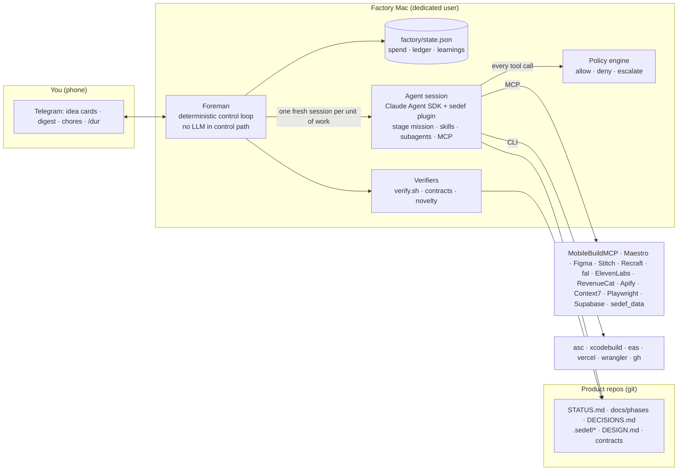

# Architecture

## 1. Shape of the system

The **foreman** (`runner/`) is plain TypeScript: it never asks a model what to do next. It plans jobs, launches sessions, runs deterministic checks, routes products and talks to you. Models do the work inside sessions; code decides whether the work counts.

## 2. The pipeline

| # | Stage | Scope | Model tier | Web | Key MCP | Exit checks (deterministic) | Next |
|---|---|---|---|---|---|---|---|
| — | scout | factory, daily | strategist | open, **no shell** | sedef_data, apify | — (cards ingested) | 💡 idea gate (you) |
| 1 | validate | product | strategist | open, **no shell** | sedef_data, apify | brief + verdict (go/kill, lane) | spec · killed |
| 2 | spec | product | lead | docs | context7 | feature list, phases, progress = 0, `verify.sh contract` | brand |
| 3 | brand | product | strategist | open | sedef_data, fal, recraft, replicate, stitch, figma | DESIGN.md lints, novelty passes, icon exists | design |
| 4 | design | product | lead | open | figma, stitch, mobbin, refero, playwright, mobilebuild | ui-spec, motion, screens, critique = pass | build |
| 5 | build ⟲ | product | lead | docs | mobilebuild, maestro, context7, playwright, revenuecat, supabase | `verify.sh quick` + progress increased; stop gate | build · qa |
| 6 | qa | product | lead | docs | mobilebuild, maestro, playwright | report + verdict | store · build |
| 7 | store | product | lead | open | mobilebuild, playwright, fal, recraft, elevenlabs, revenuecat | compliance pass, `verify.sh store` | release |
| 8 | release | product | lead | docs | revenuecat, expo | release.json status | release_watch · launch · (wait for chores) |
| 9 | release_watch | product, every 2 h | fast | none | — | review-status next | launch · grow · review_fix · wait |
| 10 | review_fix | product | lead | docs | mobilebuild, maestro | release.json status | release_watch |
| 11 | launch | product | lead | docs | fal, recraft, elevenlabs, playwright | launch plan + baseline | grow (+7 days) |
| 12 | grow ⟲ | product, weekly | lead | docs | sedef_data, revenuecat, context7 | growth report + decision | grow · build · sunset |
| — | portfolio | factory, weekly | strategist | docs | sedef_data, revenuecat | decisions.json applied | — |
| — | retro | factory, weekly | lead | none | — | learnings + proposals | — |

Priorities: products closer to launch run first; factory jobs (scout/portfolio/retro) get slots before product jobs because they are rare. `max_parallel_sessions` (default 2) and `max_active_products` (default 3) bound the work in progress.

Failures: a failed attempt writes `.sedef/feedback/<stage>.md` (the next session reads it first) and retries up to `max_attempts`; then the stage's `on_exhausted` applies — park (you see it in the digest), kill, or re-plan (build → spec, at most `max_replans` times). Failures that aren't the product's fault are kept apart: an account-level API refusal (bad key, no credit) aborts the session at once and pauses the factory; an outage or lost network backs the product off 15/30/60 min without counting the attempt (bounded to three in a row). See OPERATIONS.md.

## 3. Sessions: fresh context, narrow powers
Each session is `query()` from the Claude Agent SDK with:
- the Claude Code system prompt + the stage mission (`prompts/stages/<stage>.md`, rendered with product variables and the previous attempt's feedback);
- the `sedef` plugin (subagents, skills, hooks) plus globally installed third-party skills;
- **only** the built-in tools the stage needs (`tools`), never self-scheduling tools (CronCreate, ScheduleWakeup, RemoteTrigger), push notifications, plan mode or AskUserQuestion;
- **only** the MCP servers the stage lists (`strictMcpConfig`: user or plugin MCP configs never leak in), with secrets resolved by the foreman into the server config — never into the agent's shell environment;
- `maxTurns`, `maxBudgetUsd` and a wall-clock timeout. A stage starts only when its full budget is free today and this month (after what running sessions have reserved), so no session fails just because it was launched underfunded;
- before the session: the stage's verdict files (`reset:` in pipeline.yaml) are moved aside to `*.prev.json`, and on a stage's first attempt the route field of a stateful file (`release.json` status, `progress.json` complete) is blanked — only this session's answer can route the product;
- after the session: a session that didn't finish cleanly (turn/budget limit, API error) never passes — except build, which is judged by measurable progress, and a reported irreversible action (a store submission), which a re-run would only repeat; a route value that leads nowhere is a failed attempt, not "done";
- a PreToolUse hook that sends every tool call (main thread and subagents) through the policy engine, and — for build — a Stop hook that runs `verify.sh quick` and refuses to let the session end while it fails (at most two nudges; Ralph-style pressure without infinite loops).

## 4. Policy engine (`config/policy.yaml`, `runner/src/policy.ts`)
Replaces the human permission prompt with rules:
- **Protected paths** (`~/.sedef/**`, keychains, `~/.asc`, `.p8/.p12`, `.env` …) — never readable or writable. A Grep/Glob rooted at a folder that *contains* one (home, `~/.sedef`, `/`) is refused too, and shell commands that name them — also when split with quotes or backslashes, or globbed as `~/.x*` — are denied.
- **Protected writes** — `.mcp.json`, `.claude/**`, `~/.claude/**`, git hooks, and at runtime the factory's own code, config, plugin, prompts, templates, state, ledger and logs. Agents cannot change what future sessions load; skills change only through reviewed proposals.
- **Immutable contracts per stage** — `verify.sh`, `project.env`, `.maestro/acceptance/**`, `tests/acceptance/**`, `DESIGN.md`. Enforced three ways: tool policy, shell-command rules, and a snapshot/restore around every session (tampering fails the attempt).
- **Scoreboard ownership** — only `sedef:evaluator` may write `progress.json`, `feature_list.json`, `evaluations/` during build; reviewers (evaluator, QA, compliance) may only write inside `.sedef/` or evidence folders.
- **Bash rules** — no sudo, no pipe-to-shell, no force-push, no keychain access, no env dumping, no remote shells, no system settings, no destructive store/hosting operations, no factory control commands.
- **Escalations** — `asc web …` (unless web-session automation is on), new-app store submissions (`asc publish appstore --submit`, `asc review submit`, Play production) over the rolling 30-day cap or before your first-submission approval — updates and resubmissions of an app already in the store pass — plus domain/DNS and ad spend. They are blocked in-session and become chores.
- **Browser** — the Playwright MCP's `browser_navigate` follows the stage's web access: local pages always, documentation domains in docs stages, anything only in open-web stages.
- **Tool limits** — per-session caps on paid generation tools and web calls.
- Unit-tested (`runner/test/policy.test.ts`, `config.test.ts` against the real YAML).

## 5. Capability separation (prompt-injection defense)
The dangerous combination is untrusted content + private data + a way to act on the world. Sedef splits it:
- **scout, validate** are the only stages that read the open web. They have **no shell** and **no secrets**, their file tools can't reach secret files (not even by searching a parent folder), and they reach store data through `sedef_data`, an in-process tool limited to documented public APIs (iTunes Search/Lookup, HN Algolia, RDAP, npm, GitHub) over HTTPS with rate limits.
- **Every stage with a shell** (brand, design, build, qa, store, release, review_fix, grow, launch) fetches documentation domains only — WebFetch and the Playwright browser alike — and uses web *search* at most. Stages that hold release/deploy tokens get exactly the tokens their lane needs.
- Credentials live in the keychain (asc, Anthropic via `apiKeyHelper`) or in `~/.sedef/.env`, which agents' file tools cannot read.
- A config integration test fails the build if any stage combines open web with secrets.

### Security: what this does and doesn't protect
The policy is guardrail logic in front of every tool call, not an operating-system boundary. What remains possible for an agent that has been talked into misbehaving:
- A stage **with a shell** runs as the factory's macOS user: with enough cunning (variables, encodings) it can read what that user can read, and a stage holding a token can send it somewhere with `curl`. Untrusted input reaching those stages is limited (no arbitrary web pages; customer reviews in grow and rejection text in review_fix are the main channels), which is why they are told to treat such text as data.
- Hence the layers that don't depend on the model behaving: a **dedicated macOS user** with nothing personal on it; **narrow keys** (App Store Connect key with the App Manager role, not Admin; a Vercel/Cloudflare token scoped to one team/account; a Console workspace with a monthly cap; provider spend limits); and rotation (OPERATIONS.md → Safety checklist).
- Optional hardening: pipeline stages accept a `sandbox:` block that is passed to the SDK sandbox (macOS Seatbelt) — e.g. `sandbox: { enabled: true, filesystem: { denyRead: ["~/.sedef", "~/.asc", "~/.ssh"] }, network: { allowedDomains: [...] } }`. Builds touch many hosts (SPM, CocoaPods, npm, Apple), so test a sandboxed stage on your Mac before relying on it.

## 6. Verification, progress and the judge
- `spec` writes contracts; `verify.sh contract` checks every feature has one. On a re-plan (build exhausted its attempts) finished work is kept and the product goes straight back to build — brand and design stay.
- Each build session must finish exactly one phase: `verify.sh quick` passes **and** `progress.phases_done` increases (only the evaluator can increase it, after checking every acceptance criterion with evidence).
- `qa` runs `verify.sh full` and an exploratory matrix; `fix` routes back to build with a new phase.
- `store` requires a passing compliance audit and `verify.sh store`; `release` deploys the legal site and checks every store URL before submitting.
- **Loop guards:** a stage entered more than six times in one release cycle (QA ⇄ build ping-pong) parks the product; a stage that routes to itself without a poll interval (release waiting for you) waits 1 h, then 2 h, 4 h, 8 h; after five such loops with nothing asked of you it stops and asks you instead. A blocking chore wakes it as soon as you close it.

## 7. Distinctiveness engine
- `plugin/skills/taste-engine/scripts/draw.mjs` — seeded (FNV-1a of the slug), ledger-aware constraint-deck draw across 11 axes (era, material, typeface class, color model, grid, motion, illustration, iconography, voice, sound, icon form), excluding values recent products used.
- Verbalized Sampling prompts for art direction and naming (sample from the tail, p < 0.10).
- DESIGN.md (Google's format) as the design contract; linted.
- `sedef novelty check` — weighted categorical distance across direction axes + OKLab ΔE on palette + Jaccard on fonts + icon style/name pattern/category/mechanic; hard violations for font reuse within a window and near-identical primary colors.
- Critique by a different model family when configured (`sedef critic`), otherwise the evaluator with a fixed rubric.
- Web lanes: `impeccable detect` (deterministic anti-pattern rules) in `verify.sh full`.

## 8. Human interface
Telegram only (Turkish): idea cards with ✅/❌ buttons, a 21:00 digest (moves, spend, parked products, chores), immediate messages for launches, rejections, parks and blocking chores (held during quiet hours), and commands (`/durum /fikir /isler /tamam /red /oldur /dur /devam /butce /onayla /gec /oneriler /uygula`). The CLI (`sedef …`) mirrors them on the Mac; while the daemon runs, CLI commands are queued through `factory/inbox/`.

## 9. State & recovery
`factory/state.json` is written atomically after every mutation; one foreman at a time (pid lock). A crash or restart turns "running" products back into "ready" and gives the interrupted attempt back; aborted sessions don't count as attempts; a runner error while handling a product parks it once its attempts are used up. Every session's transcript summary is in `factory/logs/sessions/<date>/`. Product repos are committed after every session (and pushed if a GitHub owner is configured).

## 10. Extending
- **New stage:** add it to `pipeline.yaml` and a mission in `prompts/stages/`; the config test validates references.
- **New lane:** a `templates/<lane>/` folder with `.sedef/verify.sh` implementing `contract|quick|acceptance|full|store`, a `LANE_TEMPLATES` entry, and a section in `plugin/skills/lanes`.
- **New MCP server:** an entry in `config/mcp.json` (use `${ENV}` placeholders), then list it on the stages that need it.
- **Parallel workers inside one product:** give each worker its own git worktree and a task graph (Beads is the proven option); keep the evaluator independent.
